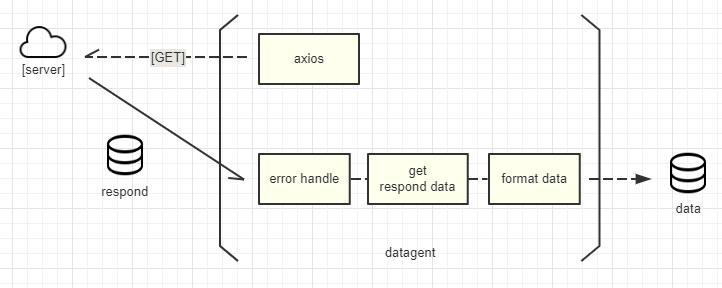

# Datagent

[](https://www.npmjs.com/package/datagent)
[](https://www.npmjs.com/package/datagent)
[](https://travis-ci.org/lpreterite/datagent)
[](https://app.fossa.io/projects/git%2Bgithub.com%2Flpreterite%2Fdatagent?ref=badge_shield)

`datagent`是一个用于前端请求的模块化管理工具，提供数据格式化、多服务源切换、语义化数据定义等功能。在 React,Vue,Angular 等现代 JavaScript 框架下，UI 显示均基于数据进行驱动，从服务端获得的数据并不能完全符合 UI 所需的结构。格式化数据、转义数据不可避免而代码往往写在任何地方又不易于维护。面对这种情况可使用`datagent`统一格式化从服务端获得的数据，并提供统一的请求服务的方式，让你更方便同步 UI 状态。



> 你可以马上尝试在`codepen`上的[例子](https://codepen.io/packy1980/pen/OEpNWW/)。

## 安装

```sh
npm install -S datagent
//or
yarn add datagent
```

目前正式版本为`1.x`，下面是安装`2.0`版本尝尝鲜。

```sh
npm install -S datagent@next
// or
yarn add datagent@next
```

## License

[](https://app.fossa.io/projects/git%2Bgithub.com%2Flpreterite%2Fdatagent?ref=badge_large)
