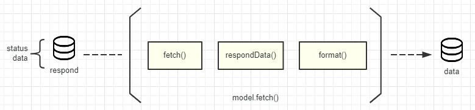
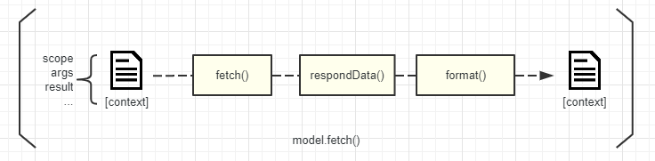
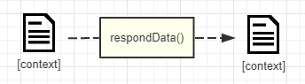

# Datagent

[](https://www.npmjs.com/package/datagent)
[](https://www.npmjs.com/package/datagent)
[](https://travis-ci.org/lpreterite/datagent)
[](https://app.fossa.io/projects/git%2Bgithub.com%2Flpreterite%2Fdatagent?ref=badge_shield)

`Datagent`是一个用于模块化管理前端请求的工具，提供数据格式化、多服务源切换、语义化数据定义等功能。在 React,Vue,Angular 等现代 JavaScript 框架下，UI 显示均以数据驱动为中心，服务端提供的数据不是所有场合都能符合 UI 所需的结构。格式化数据、转义数据的代码往往不可避免的写在UI组件、业务逻辑代码或是页面等各个地方，导致冗余代码、逻辑复杂又难以维护等问题。面对这类情况可使用`Datagent`解决这类问题，不单单能统一调取后端服务和格式化从服务端获得的数据，定义一些处理后还能用于所有场景，让你更方便同步UI状态。


> 你可以马上尝试在`codepen`上的[例子](https://codepen.io/packy1980/pen/OEpNWW/)。

## 安装

```sh
npm install -S datagent
//or
yarn add datagent
```

目前正式版本为`1.x`，下面是安装`2.0`版本尝尝鲜。

```sh
npm install -S datagent@next
// or
yarn add datagent@next
```

## License

Datagent是根据[MIT协议](https://github.com/lpreterite/datagent/blob/master/LICENSE)的开源软件

## 介绍

### 什么是 datagent.js

<!-- [描述datagent是什么？解决了什么问题？比如，定义数据字段能提供易读性，提供钩子对数据统一处理等] -->

Datagent 是由`data`与`agent`组合而成的词，意思为数据代理。后端返回的数据有时候是结构上的不同，有时候是字段类型上的不同，前端无法拿起就用需要各种处理。解决方法本很简单，就是每次获得数据后做一遍处理。在日渐增多的系统下，这种处理可能出现在各种地方，维护起来非常吃力。Datagent 的出现是为了解决上面这种情况而诞生，Datagent 关注的是如何管理你的代码，为提高易读性和易维护性而助力。如果你没有一套后端服务的方案管理，不妨试试`Datagent`可能有意想不到的惊喜哦！🙈

### 开始

<!-- [提供代码及可交互的例子] -->

使用 Datagent 无法马上开箱即用，它需你的适度的了解。了解如何合理地使用，了解什么是远端、链接管理器、数据模型、数据对象、数据对象代理等概念。不用着急，阅读完这篇文档用不着多少分钟，接下来会逐步讲解如何使用。

### 管理你的服务

<!-- [介绍如何使用链接来管理远端，列出一般使用场景例子] -->

服务，一般指的是后端服务，前端展示的数据内容大多来自后端服务。在一些项目，后端服务并不只有一个，当需要对接多个的时候代码上都会稍稍有点混乱。下面使用 Datagent 的链接管理器来管理多个服务：

```js
// #api
import axios from "axios"
import datagent from "datagent"
export default datagent.contact({
    local: axios.create({ baseURL: "http://localhost" }),
    baidu: axios.create({ baseURL: "http://baidu.com" })
})
```

在你需要请求数据时，只需要加载上面的文件进行后续操作：

```js
// #user.detail.vue
import api from "./api"

export default {
    async mounted() {
        const res = await api.remote().get(`/user/1`)
        if (res.status > 201) throw new Error("http error")
        this.detail = res.data
    },
    data: {
        detail: {}
    }
}
```

### 定义数据字段

数据是软件系统中最主要的内容，有时候在不同模块中描述同一样事物的数据结构是一样的，编码过程中能统一定义这种数据，在维护时就更能从代码中看出这份数据包含哪些内容了。

```js
// #user.schema.js
import datagent from "datagent"
export default datagent.schema({
    id: { type: Number, default: null },
    username: { type: String, default: "" },
    role_id: { type: Number, default: null },
    permission: { type: Array, default: [] },
    updated_at: { type: Date, default: null },
    created_at: { type: Date, default: null }
})
```

上面是用户数据的数据定义例子，在你 UI 层需要使用默认值时可使用以下代码：

```js
// #user.detail.vue
import api from "./api"
import userSchema from "./user.schema"

export default {
    async mounted() {
        const res = await api.remote().get(`/user/1`)
        if (res.status > 201) throw new Error("http error")
        this.detail = res.data
    },
    data: {
        detail: userSchema.serialize()
    }
}
```

### 数据处理

<!-- [举一个数据需要处理的情况，引申这种情况存在的问题（比如每次发送数据、接收数据都需要处理，需要配置一次通用其他地方），介绍可以使用数据模型管理数据字段及字段格式，使用数据对象操作数据交互，在数据对象的钩子中对获得的/需发送的数据进行统一处理等] -->

在获得后端数据后有时并不能符合 UI 格式，比如获得数据的更新时间数据类型是 String 类型，使用如 iview 的 datapicker 这类组件用户操作后返回的是 Data 类型。

对于这种情况可以使用`Datagent`在获得数据后进行转变字段的数据类型，一般设置在数据对象的方法钩子处，进行统一的转换：

```js
// #user.model.js
import contact from "./api"
import userSchema from "./user.schema"
import datagent from "datagent"
const { respondData, formatFor } = datagent.hooks
export default datagent.model({
    name: "user",
    contact,
    hooks: {
        find: method => [
            method(), //执行原来的方法，比如当前的方法find
            respondData(), //从respond提取返回的结果
            formatFor(userSchema) //格式化指定的内容，默认是返回的结果
        ]
    }
})
```

经过上面的设置当你用数据对象的方法请求数据后，就会获得格式化完成的数据：

```js
// #user.detail.vue
import userModel from "./user.model"
import userSchema from "./user.schema"

export default {
    async mounted() {
        const userData = await userModel.find({ id: 1 })
        this.detail = userData
    },
    data: {
        detail: userSchema.serialize()
    }
}
```

`respond`回来的数据:

```json
{
    "id": "1",
    "username": "packy",
    "role_id": "1",
    "permission": [],
    "updated_at": "2019/11/08 11:45:30",
    "created_at": "2018/01/08 01:32:11"
}
```

页面`detail`获得的数据:

```json
{
    "id": 1,
    "username": "packy",
    "role_id": 1,
    "permission": [],
    "updated_at": "Fri Nov 08 2019 11:45:30 GMT+0800", //typeof Date
    "created_at": "Mon Jan 08 2018 01:32:11 GMT+0800" //typeof Date
}
```

### 统一调用

<!-- [某些项目存在非常多的数据对象需要管理，页面请求数据是存在状态的（加载中、成功、失败），管理多个数据对象请求再反应至页面状态是一件麻烦事，这里接受统一处理的办法。] -->

在目前常见的 UI 页面设计中，UI 状态离不开加载态。管理 UI 状态是一件麻烦事，如要做到按加载的数据来管理 UI 相应位置的状态便需要在每次请求统一处理。datagent 也提供的工具帮助你解决这种问题：

```js
// #user.detail.vue
import datagent from "datagent"
import userModel from "./user.model"
import userSchema from "./user.schema"
const agent = datagent.agent([userModel])

export default {
    beforeCreate() {
        agent.on("error", err => {
            alert(err.message)
            console.error(err)
        })
        agent.on("before", ctx => (this.loading[ctx.name] = true))
        agent.on("after", (err, result, ctx) => (this.loading[ctx.name] = false))
    },
    async mounted() {
        const userData = await agent.find(userModel.name, { id: 1 })
        this.detail = userData
    },
    data: {
        detail: userSchema.serialize(),
        loading: {
            [userModel.name]: false
        }
    }
}
```

## 深入了解

### 远端与axios

<!-- [为何使用axios？却又包装一遍？举个继承远端后重写方法支持其他http库的例子] -->

远端的设计给了datagent能换不同的Http请求工具。datagent默认支持的axios是前端最常用的http请求工具，当你需要改成其他的请求工具，远端这层的抽象就起到了一个非常好的作用。下面例子用浏览器默认支持的`fetch`替换axios：

```js
// Remote.class.js
import fetch from "node-fetch"
import { URLSearchParams } from "url"

class Remote {
    constructor(options){
        const { baseURL, withJson=true } = { ...options }
        this._baseURL = baseURL
        this._withJson = withJson
    }
    sync(options){
        let { method, data, body, headers } = options
        const url = this._baseURL + options.url
        if(this._withJson){
            headers = !!headers ? headers : {}
            headers['Content-Type'] = 'application/json'
            body = JSON.stringify(data)
        }else{
            body = data
        }
        return fetch(url, { method, body, headers }).then(res=>new Promise((resolve, reject)=>{
            res.json().then(data=>resolve({
                status: res.status,
                statusText: res.statusText,
                data,
                headers: res.headers,
                url: res.url
            }), reject)
        }))
    }
    get(url, _params={}){
        const params = new URLSearchParams()
        Object.keys(_params).forEach(key=>params.append(key, _params[key]))
        url += `/${params.toString()}`
        return this.sync({ method: "GET", url })
    }
    post(url, data){
        return this.sync({ method: "POST", url, data })
    }
    put(url, data){
        return this.sync({ method: "PUT", url, data })
    }
    patch(url, data){
        return this.sync({ method: "PATCH", url, data })
    }
    delete(url, data){
        return this.sync({ method: "DELETE", url, data })
    }
}
export default Remote
```

数据对象中的方法访问服务时是透过链接管理器进行的，所以最终需要在生成链接管理器时把构造器替换掉，这样请求就不是用`axios`而是用`fetch`：

```js
import datagent from "datagent"
import CustomRemote from './Remote.class'
const contact = datagent.contact(
    //remote的设定
    {
        base: { baseURL: 'https://jsonplaceholder.typicode.com' }
    },
    //生成时替换为自定义的remote
    {
        RemoteConstructor: CustomRemote
    }
)

contact.remote().get('/todos/3').then(res=>{
    console.log(res.data)
})
```

输出结果：

```json
{
    userId: 1,
    id: 3,
    title: "fugiat veniam minus",
    completed: false
}
```

关于Remote的详情可以查看[API文档](./API.md#remote-1)，自定义完整例子参考[仓库测试的例子](../test/examples/custom-remote.test.js)

### 自定义字段类型

<!-- [数据类型是可定义的，默认是Function类型就可以了，附上合理的例子进行说明] -->

数据模型的字段类型除了支持系统的`Array`,`Number`,`String`等类型外，还支持自定义的类型。

接下来让我们看看例子：

```js
//# Yuan.type.js
export function Yuan(val) {
    return (parseInt(val) / 100).toFixed(2)
}
```

经过沟通知道后端服务返回的商品价格是以分为单位的，前端显示的时候需要对其进行转换，这里我们先自定义字段类型 Yuan（元）。

```js
//# good.schema.js
import datagent from "datagent"
import Yuan from "./Yuan.type"
export default datagent.schema({
    id: { type: Number, default: null },
    good_name: { type: String, default: "" },
    good_type: { type: String, default: "" },
    price: { type: Yuan, default: 0 },
    updated_at: { type: Date, default: null },
    created_at: { type: Date, default: null }
})
```

然后在商品的模型中将价格的字段类型改为`Yuan`。

```js
import goodSchema from "./good.schema"
console.log(
    goodSchema.format({
        good_name: "《人月神话》",
        good_type: "book",
        price: "48000",
        updated_at: "Tue Nov 19 2019 14:11:12 GMT+0800",
        created_at: "Tue Nov 19 2019 14:11:12 GMT+0800"
    })
)
```

下面就是经过数据模型的方法转换后的数据：

```json
{
    "good_name": "《人月神话》",
    "good_type": "book",
    "price": "48.00",
    "updated_at": "Tue Nov 19 2019 14:11:12 GMT+0800",
    "created_at": "Tue Nov 19 2019 14:11:12 GMT+0800"
}
```

上面例子是将请求数据的价格字段从`分`转变为`元`，用自定义的类型就能满足此类需求。系统提供的类型均是`Function`，所以字段类型只要是`Function`就能支持。

### 方法与钩子

<!-- [讲解数据对象的方法执行过程，钩子是在什么情况下介入，如何决定执行顺序的，等等] -->



数据对象的方法执行过程，实际是**串行执行多个函数的过程**。拿`fetch()`作为例子，首先执行内部的`fetch()`从服务端获取数据；然后再执行`respondData()`函数从`respond`提取数据出来(data)；最后执行`format()`函数对提取出来的数据进行格式化处理。

```js
// #user.model.js
import contact from "./api"
import userSchema from "./user.schema"
import datagent from "datagent"
const { respondData, formatFor } = datagent.hooks
export default datagent.model({
    name: "user",
    contact,
    hooks: {
        fetch: method => [
            // 用怎样的钩子函数，完全可选可控
            method(),
            respondData(),
            formatFor(userSchema)
        ]
    }
})
```

`fetch`的钩子设置函数中传入的`method`函数实质为`fetch()`方法，这样就能更灵活地控制它与其他钩子函数间的执行顺序了。

### 自定义方法

日常100%会遇到需要在`model`内容增加新的方法来实现新的交互，下面就是给`user`增加启用/禁用功能。

```js
// #user.model.js
import contact from "./api"
import userSchema from "./user.schema"
import datagent from "datagent"
const { respondData, formatFor } = datagent.hooks
export default datagent.model({
    name: "user",
    contact,
    methods: {
        // 自定义方法，向服务端发送`[PATCH]`请求，禁用用户
        disabled(data, opts, ctx){
          // 最全的处理方法（推荐）
          const { origin } = {...opts}
          const { contact, url, getURL, emulateIdKey, isNew } = ctx.options
          const { id } = data
          const _url = getURL(id, url, emulateIdKey)
          return contact.remote(origin).patch(_url, {...data, disabled: true})
        },
        enabled(data, opts){
          //简单的处理方法
          const { origin } = {...opts}
          const { id } = data
          return this.contact.remote(origin).patch(this.getURL(id), {id, disabled: 1})
        }
    },
    hooks: {
        fetch: method => [
            // 用怎样的钩子函数，完全可选可控
            method(),
            respondData(),
            formatFor(userSchema)
        ]
    }
})
```

### 自定义钩子

<!-- [介绍制作钩子的规范，传入可自定义，返回一个接收和返回执行方法的上下文的函数，上下文包含哪些参数，在修改的过程中需要注意的细节，哪些是允许的，哪些是不推荐的] -->



钩子函数之间是基于`Promise`和`执行上下文(Context)`两份协议进行通讯。钩子函数接收上下文作为传入的参数，无论处理情况最终都会抛出`Promise`包裹的上下文内容，传给下一个钩子函数就行后续操作。

`Promise`就不用过多说明，执行上下文包含以下内容：

| 名称   | 类型         | 必须             | 描述                                                   |
| ------ | ------------ | ---------------- | ------------------------------------------------------ |
| scope  | `Object`     | 是               | 方法执行的上下文，影响 this 指向                       |
| args   | `Array<any>` | 是，可以为空数组 | 来自方法的传入参数，在执行方法时决定了存放的参数与数量 |
| method | `String`     | 是               | 方法名称，一般是原方法的名称                           |
| result | `any`        | 否               | 默认为 null，用来存放最终抛出的结果                    |

如果需要传递更多信息，直接添加至上下文内就可以了，如：

```js
export function setUser(user){
    return ctx => {
        ...ctx,
        user
    }
}
```

`respondData`可作为钩子函数的完整参考例子：



```js
// # datagent/src/operations:35
export function respondData() {
    return ctx => {
        const res = ctx.result
        if (res.status < 200) {
            const err = new Error(res.message)
            err.response = res.response
            throw err
        }
        ctx.result = res.data
        return Promise.resolve(ctx)
    }
}
```

更多例子可看[datagent/src/operations.js](../src/operations.js)

## 迁移

### 从 1.x 迁移

[陆续补上，敬请期待]

#### FAQ

<!-- [核心概念没有变化；新增了agent统一管理数据对象；部分定义换叫法了，比如`schema`改叫数据模型，`model`改叫数据对象；数据模型中方法的钩子移除before和after概念，变成可定义执行顺序；] -->

[陆续补上，敬请期待]

<!--
修改建议：

- [ ] 建议加上自定义方法的说明
- [x] 统一调用的代码例子中，agent代理命名为models，而下面使用时却用datagent来监控，这里明显写错了，建议修改。
- [x] Model.model_name 需要改为 Model.name

-->